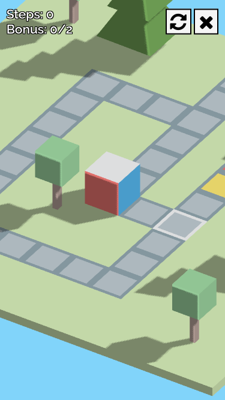

# .buk

.buk is a cube rolling puzzle game [Online version](https://industrial-revolutioners.github.io/buk/)

> Reached the 2nd place at Function 2016 game development competition

## How to play the game?

After selecting a level you can control the game from either keyboard
or from touch screen.

If you're on touch screen then:

-   Swipe up, down, left or right to roll the cube to the desired
    direction
-   Swipe left or right at the bottom of the screen to rotate the camera
    clockwise or counter-clockwise.
-   Pinch to zoom

Or from keyboard:

- `w` or `up arrow` - Move forward
- `s` or `down arrow` - Move back
- `a` or `left arrow` - Move left
- `d` or `right arrow` - Move right
- `shift + a` - Rotate the camera clockwise
- `shift + d` - Rotate the camea counter-clockwise
- `shift + w` - Zoom in
- `shift + s` - Zoom out

## What's the goal of the game?

The goal is to roll the cube on the level towards the exit. The cube
can step on the tile if the side of the cube matches the color of the
tile.

## How can I earn stars?

-   You get the first star if you finish the level successfully.
-   The second star is given if you collect all the bonuses on the level.
-   The third star is given if you finish the level with the fewest steps. 

## It does not work / it's ugly!

We've tested the game and should work in:
 
-   Google Chrome 53.0.2785.101
-   Google Chrome Android 52.0.2743.98
-   Firefox 48.0
-   Firefox Android 48.0

Unfortunatelly we don't have the equipments to check if the game works 
in Safari (and entirely on MacOS and iOS devices), Microsoft Edge or 
Internet Explorer so it's very likely that it won't work.

If you see the shadow is a skewed, or that some surfaces shine
so bad it's natural. Texture flickering (z-fight) might appear on some
poor hardware.

# Development stuff

## Requirements

You need Node.js 6.3.1 or newer to start developing.

To bootstrap your environment run `npm run bootstrap` in the root
directory of the project.
 
> This npm script will install all dependencies and type definitions

## Development

Run `npm run develop` to start the development server and navigate to
`http://localhost:3000` (as seen in the console output).

Any change you make in the `src/` directory will trigger the browser
to reload. The server is available externally to so you can access
the application on your phone easily.

*To set it up in VS code check 
[these](https://gist.github.com/caiwan/c23ee4b06e6c90748b2da58a9ea98e38) 
sample jsons.* Also please note that
`/// <reference path="../../typings/index.d.ts" />` line seems to be
mandatory before any includes to make it work with it *(But also YMMW)*.
Please don't remove them.

## Release build

Simply run `npm run build`. The result will be written in `dist/`

## Changelog

### v1.0.0 - 2016-09-10

This version should work in Firefox (tested with 48.0).

I know it's not a huge improvement but we consider this state of the game
as the 1.0.0 version.

### v0.0.1 - Function 2016 party version - 2016-09-10

This is the party version as it was released at Function 2016.

Known issues:

Doesn't work in Firefox
Doesn't work on iOS (only Chrome desktop/android is fully supported obviously)
On some devices (usually on lower hardwares) may have some flickering (z-fight)
